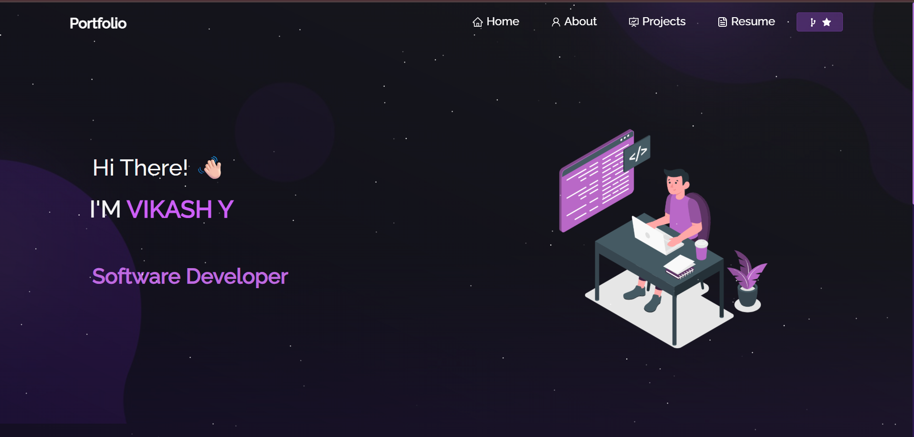

<h2 align="center">
  Personal Portfolio - v1.0<br/>
  <a href="https://vikash0706.github.io/Portfolio/" target="_blank">VikashY.github.io</a>
</h2>

<div align="center">
  
</div>

<br/>

<p align="center">
  <a href="https://forthebadge.com"></a>
  <a href="https://forthebadge.com"></a>
  <a href="https://forthebadge.com"></a>
</p>

---

## 🚀 Overview

This is my personal developer portfolio website built with React.js. It features my GitHub projects, resume, and technical skills. Feel free to fork it and customize your own.

> Deployed at: [vikashy.github.io](https://vikash0706.github.io/Portfolio/)

---

## 🛠 Built With

- **React.js**
- **Node.js**
- **Express.js**
- **CSS3**
- **React-Bootstrap**
- **VS Code**
- **Vercel** (for hosting)

---

## 🎨 Features

- 📄 **Multi-Page Layout**
- 💡 **Clean UI using React-Bootstrap**
- 📱 **Fully Responsive Design**
- ⚡ **Fast and Lightweight**

---

## ⚙️ Getting Started

### 📦 Installation

Clone the repository:

```bash
git clone https://github.com/vikashy/portfolio.git
cd portfolio
npm install

